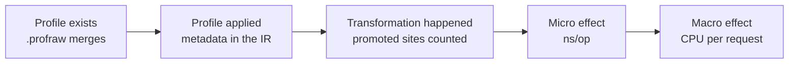

# BRIEF — instrumentation PGO for Kotlin/Native

> **Role of this document: the pre-registration.** It records what was decided *before* the first
> measurement, so that a threshold cannot be moved to fit a number after the fact. Everything below
> the second horizontal rule is the brief as received on 2026-09-20; its headings are demoted one
> level to nest under that section and nothing else about it is edited. Amendments are appended
> here with a date and a reason; nothing is edited away.

**Budget:** the per-step budgets of the brief's Kill criteria — five working days for RQ0, two for
RQ1, one per RQ2 dispatch shape, three for RQ3 and RQ4 together, two for RQ5, half a day for RQ6.
**Owner:** Pavel (youndie).
**Output:** `docs/research/<date>-instrumentation-pgo.md`, the patch set, and raw logs under
`logs/`.

**The pins the brief left as placeholders**, resolved before the first measurement and not
re-resolved afterwards:

| Row | Pin | Where it came from |
|---|---|---|
| Kotlin release the stand carries | **2.4.20** | sborka `0.4.0.86`'s published `wip` catalog, which is where the subject takes its compiler |
| Fork tag | `JetBrains/kotlin` at **`v2.4.20`**, commit **`890ac1d94fdb80eb85f0eeb5be5e4352df987b2f`** | `git ls-remote --tags`, 2026-09-20. The commit is recorded beside the tag because a tag is a movable reference and a baseline that moves is not a baseline |
| LLVM bundled by that release | **21**, distribution `llvm-21-x86_64-linux-dev-116` | `konan.properties` of the 2.4.20 toolchain |
| Macro subject | **xyk** — Kotlin/Native, Ktor CIO, sqlx4k/SQLite in process | owner's choice, 2026-09-20; it is the only portfolio subject that already has the two-host stand |
| Subject build options | **`-Pxyk.httpClient=false -Pxyk.outbound=real -Pxyk.staticLink=true -Pxyk.allocator=paged-off`** — the ingest-only, statically linked, paged-off build | `xyk/server/build.gradle.kts` lines 28–44 name all four axes and their defaults; this is the arm xyk's own two-host measurement was taken on, so the ruler priors describe the same binary |
| Hosts | xyk's pair, as ssh destinations: **`SUBJECT=bench-a`**, **`GENERATOR=bench-b`** — both 4 cores, kernel `7.0.0-30-generic` | supplied by the owner 2026-09-20 and probed the same day; `xyk/bench/` takes these two names and refuses to take a number on one host. See amendment A1.2 |
| Ktor / coroutines | 3.5.2 / 1.11.0 | the same catalog |

**Provenance of the text below.** The brief as received is `sha256
77d8480c45cba5eae46d7f46f7006a23fe336492bb43a54f7902c87608859a77`, 18 849 bytes. Restoring the
embedded copy — undoing the heading demotion and nothing else — reproduces that digest exactly;
verified 2026-09-20 by [B-01](docs/backlog/B-01-pins-and-the-amendment-window.md). The digest is
recorded because the received file lives outside this repository, so the check is reproducible
only by someone who still holds it; making it checkable from the repository alone is
[B-14](docs/backlog/B-14-make-the-freeze-checkable-from-the-repo.md).

## Amendments

Made on 2026-09-20, **before the first measurement**, each with the measurement elsewhere in the
portfolio that motivated it. The window closes at the first measurement of this study. The
evidence for every one of them is in
[docs/research/research-architecture.md](docs/research/research-architecture.md).

### A1.1 — the macro unit is read from pinned-core occupancy, with `utime+stime` beside it

The brief's Macro unit row says `utime+stime` over the clean window divided by responses. The JIT
phase measured that estimate overstating by **6.4–7.2 % on its host, constantly**, and wrote the
recommendation for future stands into its own research: take the cost per request from the
occupancy of the pinned cores in `/proc/stat`, which is bounded above by physics and converges with
the truth at saturation. Both numbers are recorded; the core-occupancy one is the unit of the
verdict. Ratios between arms survive either way — the amendment protects the absolutes, which are
what a published µs-per-request figure is.

### A1.2 — the "two-host protocol of the JIT phase" is xyk's protocol, and is pinned as such

The brief's Hosts row cites a protocol the JIT phase did not run. That phase's own research records
that the subject and the generator shared all twenty cores in **every** configuration, including
the one its article called pinned. The protocol the brief describes — subject host and generator
host, a fixed offered rate, arms interleaved, the first round discarded as warm-up — is xyk's, run
on 2026-09-16. It is pinned by that name, and it brings one thing the brief does not ask for and
this study needs: **the generator's own ceiling is established per endpoint before any arm is
compared**, so that a number is not read off a saturated generator.

### A1.3 — the Kotlin bucket is every Kotlin symbol prefix, and the list is written down first

The brief's attribution table defines Kotlin code as "symbols with the `kfun:` prefix".
Kotlin/Native emits **twelve** `k…:` prefixes; in razves's subjects `kfun:`, `kclass:` and `kvar:`
together were 12 125 of 23 336 Kotlin-prefixed ELF symbols. The others are mostly data — vtables,
interface tables, type info — and are unlikely to carry self samples, but "unlikely" is not the
same as measured. The bucket is `^_?k[a-z]+:`, the twelve prefixes are enumerated in the results
with their sample counts, and if the eleven beyond `kfun:` carry under 1 % of samples the results
say so and the distinction stops mattering *with a number behind it*.

**This widening can only enlarge the Kotlin bucket, which moves RQ1 towards green, so it is not
allowed to stand alone.** The `kfun:`-only share is published beside the widened one, and RQ1's
verdict is stated against both. A reader who prefers the brief's literal rule gets its verdict
without recomputing anything, which is what stops a corrected definition from doing a threshold's
work.

### A1.4 — the Runtime bucket is defined by owning module, not by mangling

The brief's table separates "Kotlin/Native C++ runtime symbols" from "libc and other native". On
this subject that boundary cannot be drawn by mangling: the Kotlin/Native runtime is Itanium-mangled
(`_ZN…`), and so is the Rust that `sqlx4k` links in, because Rust's legacy scheme produces `_ZN…`
too. razves measured about **964 kB** of `tokio`, `sqlx_postgres` and `core::ptr` landing in the
Kotlin runtime under the naive rule. The bucket is therefore taken from the symbol's owning object
or klib, which razves already attributes. **This is also the definition of arm A3** — "the runtime
bitcode" — so the same correction fixes an arm, not only a table row.

### A1.5 — the kernel row is conditional, and says so rather than going missing

RQ1's instrument is `perf record -e cpu-clock`. On the portfolio's other Linux host `perf` is a
stub not built for that kernel and `/proc/*/schedstat` returns zeros; whether the cloud subject
host differs is unverified and is the first thing checked. If it cannot run, the kernel row is
reported as **not measured**, RQ1's thresholds are applied to the stated user-mode denominator, and
the write-up carries that qualification next to every RQ1 number.

**And a missing kernel row inflates the Kotlin share**, because it leaves the denominator: on a
profile where the kernel is a third of samples, dropping it multiplies every other bucket by
about 1.5. So with the kernel row missing **RQ1 cannot be reported green — grey at best**, and the
results say which condition it missed. A gate whose instrument is missing is not allowed to read
as a pass, and that includes reading as a pass by arithmetic.

## Amendment set 2 — after the first measurement, by the owner (2026-09-20)

**These break the rule the first set was written under, and the break is deliberate and named.**
Amendments A1.1–A1.5 were made before anything was measured, which is what made them legitimate.
This set is made after RQ1 and the ruler, and the owner's reason is that **the thresholds
themselves were mis-sized against a bar that did not exist when they were written**:

> "I set the 40 % and 20 % thresholds against a 5 % macro bar, before the ruler existed. At the
> measured bar of 9.3 % with four rounds, even a green RQ1 could not clear it: a 15 % return on a
> 40 % bucket is 6 % of a request."

That is an incoherence rather than an inconvenient number. None of what follows moves a threshold
to fit a result; A2.1 makes the protocol stricter, A2.2 fills a hole the brief left open, A2.3
adds a stopping rule that did not exist, and A2.4 is the one that lowers a bar — by adding
evidence rather than by relaxing a standard. Each is declared **before** the run it governs.

### A2.1 — a macro run is eight counted rounds, not four

At four counted rounds [B-03](docs/backlog/B-03-the-ruler.md) measured the ruler at ±4.6 %, so
`max(5 %, 2 × ruler)` is **9.3 %** — above anything PGO returns, and above what even a green RQ1
could produce. At eight counted rounds the ruler is ±2.44 % and the bar is the brief's own 5 %
floor. **On the three endpoints that do real work, the grey verdict of RQ1 is red in practice at
four rounds.**

### A2.2 — the offered rate is chosen by a rule, and the run must be shown unsaturated

The brief fixes "one number per endpoint" and never says how the number is chosen, which is the
same hole the JIT phase's RQ0 had. Both ends of the range distort the gate:

- **Saturated** inflates the Kotlin share — measured, and by a factor of 3.7: `/journal` read
  55.55 % saturated against 14.92 % clean ([B-07](docs/backlog/B-07-rq1-the-ceiling.md)).
- **Near-idle** inflates the kernel share, because wakeups dominate, and deflates everything
  else. 200 rps on a four-core box is close to idle.

**The rule: each endpoint runs at 50–70 % of its own saturation rate**, and every run states its
delivered rate against its offered rate and its p50. A run whose delivered rate is below its
offered rate, or whose p50 has left the flat part of the curve, is not used.

### A2.3 — the drop rule for Route A, declared before the measurement it decides

**If Kotlin self plus runtime stays under 40 % on every work endpoint at the rate A2.2 fixes,
Route A, RQ5 and RQ6 are dropped.** Kotlin self plus runtime is the most arm A3 can touch, so it
is the ceiling on the ceiling.

Applied to the numbers that already exist — at the old rate, which A2.2 says is the wrong one —
the rule would **not** fire: `/api/events` 40.69 %, `/journal` 46.24 %, `/hooks/{id}` 33.46 %.
That is recorded here so the rule cannot later be read as having been chosen to produce a
foregone conclusion.

### A2.4 — the work is re-ordered, and most of the brief is now conditional

Route A's five days are not spent yet. In order:

1. **Unblock off-host builds** ([B-16](docs/backlog/B-16-unblock-off-host-builds.md)). Every arm
   and the GC log need a rebuilt xyk and `bench-a` cannot produce one.
2. **A second RQ1 point** ([B-17](docs/backlog/B-17-rq1-second-point.md)), half a day, under
   A2.2, with one `--call-graph dwarf` capture per endpoint to fix the inclusive column.
3. **The mechanism, through Route B only** ([B-08](docs/backlog/B-08-rq0-a-merged-profile-applied.md),
   [B-09](docs/backlog/B-09-rq2-indirect-call-promotion.md)), on the microbenchmark binary,
   time-boxed to two or three days. RQ2's answer holds at any offered rate, and this is what
   "fork, study, prototype" is for.
4. **One best-case macro probe** ([B-10](docs/backlog/B-10-rq3-rq4-the-macro-arms.md)): **A3
   against A0**, through Route B, on the most favourable endpoints, at eight rounds. A3 is the
   upper bound because it covers Kotlin code *and* the C++ runtime, and the C and C++ prior of a
   5–15 % return genuinely applies to the runtime. **A null here stops the study**: A2 cannot
   succeed where A3 fails, and A4 is only needed to explain a positive result.
5. **If positive, resume the brief as written.**

### A2.5 — where the CPU actually goes is logged outside the verdicts

`_int_malloc`, `__libc_calloc` and `malloc_consolidate` are **glibc** functions, and this binary
carries Kotlin/Native's own allocator. Something is calling libc malloc heavily, and the
candidates are Ktor and kotlinx-io native-heap buffers, the runtime's own C++ containers, SQLite,
and the Rust component. A2.4's dwarf capture names the owner.

An `LD_PRELOAD` of jemalloc or mimalloc is a **one-hour probe that needs no compiler work**
([B-18](docs/backlog/B-18-allocator-probe.md)). Allocator changes are a non-goal of this brief, so
the probe is recorded outside the verdicts — it is the natural RQ1 of the next study, and its
plausible effect is larger than the best case for PGO.

---

## Amendment set 3 — the fork is not needed (2026-09-20)

**A3.1 — the "Compiler" and "LLVM tools" rows of the fixed setup are wrong at this version, and
kill criterion 2 is moot.**

The brief says *"The pipeline has to be changed, and a stock distribution cannot be"* and
*"built from the exact LLVM revision that Kotlin/Native release bundles"*, implying a fork and an
LLVM build. Neither is required:

- The stock 2.4.20 compiler exposes **`-Xllvm-module-passes`**, which *replaces the module
  optimization pipeline string outright*, plus `-Xsave-llvm-ir-after`, `-Xcompile-from-bitcode`,
  `-Xllvm-variant` and three ways to add linker inputs.
- **`llvm-21-x86_64-linux-dev-116` — the exact bundle `konan.properties` names — is already on
  the build host**, with `opt`, `llvm-profdata`, `libclang_rt.profile.a`, and `opt --print-passes`
  listing `pgo-instr-gen`, `pgo-instr-use`, `instrprof` and `pgo-icall-prom`.

So [B-04](docs/backlog/B-04-fork-at-the-pinned-tag-and-the-baseline.md) is **dropped**, and with
no fork there is no second toolchain to validate: **kill criterion 2 cannot fire and is not
tested.** Kill criteria 1, 3, 4, 5 and 6 are untouched.

**What is still out of reach without a patch, and why it does not bite.** There is no `-mllvm`
passthrough, so `pgo-instr-use` cannot be handed a profile path from the compiler's command line.
Route B applies the profile with an external `opt`, which takes the path on its own command line,
and A2.4 already made Route B the only route this study takes. If Route B proves unusable, Route
A and the fork both return.

### A3.2 — that last clause has half fired: Route B's **use** arm is unusable on a service

Recorded 2026-09-20 after [B-22](docs/backlog/B-22-replay-the-linker-command.md), and it
qualifies A3.1 rather than reversing it. A3.1 is correct that the stock compiler exposes every
flag the mechanism needs, and RQ0 and RQ2 were both carried on stock tools with no fork. But
Route B has two arms and only one of them survives contact with a real module:

- **Instrument and train: stock is enough.** Instrumented bitcode carries no profile metadata,
  kotlinc runs its own pipeline on it, and replaying the printed link command produces a training
  binary that writes an IR-level profile.
- **Apply: stock is not enough.** A module carrying profile metadata makes kotlinc emit the
  `CG Profile` module flag twice — from its LTO pipeline and from its `clang++` codegen step —
  and reject its own module. Neither copy comes from the input. The only `-Xllvm-lto-passes`
  value that avoids the collision does no LTO, and Kotlin/Native's LTO internalises and
  dead-strips 3 027 defines to 411, which no external `default<O3>` reproduces.

**What this does to the record.** Kill criterion 2 stays untested — there is still no fork, and
none was built. But *"the fork is not needed"* was too broad: it is not needed to instrument,
train, merge or apply-to-a-module, and it **is** the plausible fix for the one step that stops a
service arm. That is a finding about the toolchain and it goes in the results document; **it does
not restart Route A**, which A2.3 dropped on a bucket measurement that has nothing to do with
this and would be unaffected if the wall vanished tomorrow.

---

---

## The brief as received (2026-09-20, unedited)

## Research brief: instrumentation PGO for Kotlin/Native

2026-09-20 · @Someone

### Question

Can LLVM instrumentation PGO be made to work on a Kotlin/Native service binary from a fork of the toolchain, and how much request CPU does it remove?

The case for it is one LLVM pass. Indirect call promotion records the top targets of every indirect call, then emits a guarded direct call that the inliner can see through. That is speculative devirtualisation without deoptimisation, and Kotlin/Native has no other source of it. Branch weights, hot/cold splitting and hotness-scaled inlining thresholds come with the same profile.

The case against is that PGO improves machine code and nothing else. If a Kotlin/Native service spends most of its CPU in the allocator, the collector and the kernel, the ceiling is low whatever the profile says. RQ1 measures that ceiling before any compiler work is judged.

The working mode is fork, study, prototype. The output is a working recipe in a fork, a verdict per research question with its cost in µs of CPU per request, and the patches themselves. Nothing is proposed to JetBrains or LLVM (see Non-goals).

Three verdicts are possible per question:

- **Green:** the effect is real, the lever provably engaged, and the macro effect clears the ruler.
- **Grey:** the effect is real in a microbenchmark and below the ruler in the service.
- **Red:** the lever engaged and nothing moved, or the step could not be made to work inside its budget.

### Fixed setup

Every row is pinned to one version, written into the repo before the first measurement. A range such as "Kotlin 2.x" is not a pin.

| Item | Choice | Reason |
| --- | --- | --- |
| Compiler | A fork of `JetBrains/kotlin` at the tag of the Kotlin release the stand already carries; Kotlin/Native built from that source | The pipeline has to be changed, and a stock distribution cannot be |
| LLVM tools | `opt`, `llvm-profdata` and the compiler-rt profile runtime, built from the exact LLVM revision that Kotlin/Native release bundles | The profile format is locked to the LLVM version, and the Kotlin/Native toolchain ships almost no LLVM tools |
| Target | `linux_x64`, release binary (`-opt`), one target | Release mode compiles the program as one LLVM module, which promoted calls need in order to inline |
| Micro harness | kotlinx-benchmark on the native target, ns/op | Same shape as the JMH set of the JIT phase |
| Macro subject | One Kotlin/Native Ktor service with an in-process data layer | No co-located database taking a third of the machine |
| Hosts | The two-host protocol of the JIT phase: generator on its own machine, fixed offered rate per endpoint | rps is not a verdict unit on these hosts |
| Macro unit | µs of CPU per request: `utime+stime` over the clean window, divided by responses | The quantity that survived the JIT phase |

Five build arms are compared. Every arm comes from the same source revision and the same flags apart from the ones named.

| Arm | Build | Role |
| --- | --- | --- |
| A0 | Stock release build from the fork, no PGO | Baseline |
| A1 | Instrumented build | Produces the profile; its overhead is recorded, not judged |
| A2 | Profile applied to Kotlin code only | The main effect |
| A3 | Profile applied to Kotlin code and the runtime bitcode | What the allocator and collector gain |
| A4 | Profile from an unrelated workload applied | Separates "PGO helps" from "any rebuild moves the number" |

Macro runs interleave the arms, five rounds each, with the within-arm spread printed beside every between-arm difference.

### Non-goals

- **Anything upstream.** No YouTrack tickets, no pull requests to `JetBrains/kotlin` or LLVM, no design proposal. The fork is the deliverable. A finding that looks like an upstream bug is written down in the results document and left there.
- **A maintained fork.** The fork tracks one tag and is not rebased. Keeping it alive across Kotlin releases is a product decision, not a research result.
- **A Gradle plugin or any packaging.** The recipe is a shell script and a patch set until the verdicts are in.
- **Sampling PGO.** AutoFDO and CSSPGO need LBR or an equivalent PMU feature, which the available hosts do not expose. Instrumentation is the only route studied.
- **Other targets.** No macOS, no iOS, no `linux_arm64`. The recipe is expected to carry over; that expectation is not tested.
- **Garbage collector and allocator changes.** RQ1 measures their share of CPU and arm A3 lets PGO optimise their code. Changing their algorithms is a different study.
- **Comparison with the JVM or GraalVM Native Image.** The baseline is the same Kotlin/Native binary without PGO.
- **A JIT.** Not considered in any form.
- **Debug builds and compiler caches.** Release builds only; per-library caches split the module and hide call targets from the inliner.

### Method

The rules below come from what the JIT brief got wrong. Each one closes a hole that phase found.

#### The ruler comes first

Before any arm is compared, A0 runs against itself: the same binary, interleaved, five rounds. The spread of that run is the ruler. Two thresholds are fixed now:

- **Micro effect:** ns/op changes by at least 10%, with non-overlapping 99% confidence intervals.
- **Macro effect:** µs of CPU per request changes by at least 5%, and by at least twice the ruler.

A difference under twice the ruler is reported as "below resolution, effect under N%", with N stated. It is never reported as zero.

#### The evidence chain

A verdict needs every step up to the one it claims. Steps B and C are read from the binary that is measured, not from a sibling build.

#### A null result must show its lever engaged

Every "nothing moved" states three numbers from the measured build: functions whose profile was applied, functions whose profile was dropped on a CFG hash mismatch, and indirect call sites promoted. A null over a lever nobody proved was connected is not a result.

#### Units are controlled, not inferred

Any claim about an allocation names the object by class and size. Any microbenchmark arm has a unit control beside it: an arm that performs exactly the one operation being priced and nothing else.

#### A known-order pair runs beside everything

One pair whose order follows from the code: a variant that does everything another does plus one step. If it comes out cheaper, the run is discarded and the stand is fixed.

#### Attribution is declared before profiling

RQ1 buckets **self** samples by symbol, because PGO acts where self time is spent:

| Bucket | Rule |
| --- | --- |
| Kotlin code | Symbols with the `kfun:` prefix: application, libraries and stdlib alike |
| Runtime | Kotlin/Native C++ runtime symbols: allocator, collector, safepoints, exceptions |
| libc and other native | `memmove`, `malloc`, SQLite, anything else resolved and not above |
| Kernel | Samples in kernel mode |
| Unresolved | Reported as its own row; above 5% of samples the run is not used |

The offered rate is one number per endpoint, stated in the results, and identical across arms.

### Research questions

RQ0 and RQ1 are gates. Outcomes are declared now and not edited afterwards. **Any outcome that is neither green nor red is grey**, and the results say which condition it missed; no run can fall between the two.

| RQ | Question | Green | Red |
| --- | --- | --- | --- |
| RQ0 | Feasibility. Can a Kotlin/Native release binary write a `.profraw` that merges, and can the fork apply the resulting `.profdata`? | On the macro subject: the profile merges, and at least 80% of functions with non-zero counts have it applied in the rebuilt IR | Not reached within five working days; see Kill criteria |
| RQ1 | Ceiling. On A0 at the stated rate, what share of self CPU is Kotlin code, by the attribution table in Method? | At least 40% on a majority of endpoints | Under 20% on every endpoint |
| RQ2 | Does indirect call promotion fire on Kotlin dispatch, and what is it worth? Sites have several implementors reachable, so the compiler's own closed-world devirtualisation cannot resolve them, and one receiver at run time. Virtual (vtable) and interface (itable) calls are priced separately. | Promotion and inlining visible in the IR at the benchmark's sites, and the micro effect met on both dispatch shapes | No promotion at those sites, or promotion with the micro effect missed on both shapes; the results say which |
| RQ3 | Macro effect of A2 over A0 on the service. | Macro effect met on a majority of endpoints, and A4 within the ruler of A0 | Below resolution on every endpoint with the lever shown engaged |
| RQ4 | What does applying the profile to the runtime bitcode add? A3 over A2. | A further macro effect on a majority of endpoints | Below resolution on every endpoint with the lever shown engaged in runtime functions |
| RQ5 | How long does a profile live? It is applied to the three next real commits of the subject, and separately to a workload it was not trained on. | At least two thirds of the RQ3 effect retained in both tests | Under one third retained in either |
| RQ6 | What does it cost? Binary size of A2 and A3 against A0, measured per owner with `razves`; build time and A1's run-time overhead are recorded and not judged. | Binary size within +5% of A0 | Binary size above +15% of A0 |

The RQ1 thresholds follow from arithmetic. PGO on C and C++ servers typically returns 5–15% of the code it touches. At a 40% bucket that is 2–6% of a request, which can clear the macro threshold. At a 20% bucket it is 1–3%, which no ruler on these hosts resolves.

RQ2 carries two controls of known outcome. Eight receivers in uniform rotation should gain nothing, since no target dominates. Eight receivers at 90/10 should gain most of what the single-receiver case gains. If either control comes out the other way, RQ2's numbers are not used until the reason is found.

RQ3 and RQ4 run only if RQ1 is not red. If RQ1 is grey they run, and the write-up carries the ceiling next to every macro number.

### Kill criteria

The study stops, and the stop is written up with the same care as a result, in any of these cases:

1. **RQ0 is red.** Five working days pass without a merged profile applied to the macro subject. The write-up is the list of obstacles in the order they were hit, with the patch set as far as it got.
2. **The fork is not a valid baseline.** A binary from the unmodified fork must land within the ruler of a binary from the stock distribution of the same release. If it does not within two working days, nothing built from the fork can be compared with anything.
3. **RQ1 is red.** Kotlin code owns under 20% of self CPU on every endpoint. RQ3 and RQ4 are not started. RQ0 and RQ2 may still run as a toolchain study that makes no performance claim. The conclusion is that machine-code quality is not where a Kotlin/Native service spends its CPU, and the bucket table says where it does.
4. **The ruler is above 5%.** Twice the ruler would exceed any PGO gain worth having. The stand is fixed first or the macro half ends; the micro half may still finish.
5. **A4 matches A2.** If a profile from an unrelated workload gives the same macro gain as the trained one, the gain is not profile-guided. Macro work stops and the effect is reported as rebuild and layout noise.
6. **A control inverts and stays unexplained for two working days.** This covers the known-order pair and both RQ2 controls.

Budgets per step: five working days for RQ0, two for RQ1, one per RQ2 dispatch shape, three for RQ3 and RQ4 together, two for RQ5, half a day for RQ6. A step that overruns its budget is recorded as "not completed" with the reason, and the next step starts.

### Tooling and routes

There are two routes to an instrumented binary. Route A is the prototype; Route B is its oracle and its fallback.

- **Route A, inside the fork.** The compiler's LLVM pipeline gains `pgo-instr-gen` and `instrprof` for arm A1, and `pgo-instr-use` with indirect call promotion for A2 and A3. Both must sit at the same point in the pipeline, because the profile is keyed by a hash of each function's CFG at that point. Any pass that runs before one and not the other drops profiles silently.
- **Route B, outside the compiler.** The fork dumps the linked, pre-optimisation bitcode. An external `opt` from the pinned LLVM revision instruments or applies the profile, and the link step is replayed from the command the compiler prints. Slower and fragile, but it involves no compiler changes and shows what a correct result looks like.

The profile runtime is `libclang_rt.profile`, built from the pinned LLVM revision and added at link time. A service stops on a signal and never reaches `atexit`, so the profile is written one of two ways: a call to `__llvm_profile_write_file` through cinterop from the shutdown path, or continuous mode through `LLVM_PROFILE_FILE` with `%c`. RQ0 records which one works.

| Step | Tool | Evidence |
| --- | --- | --- |
| Profile exists | `llvm-profdata merge`, then `show --all-functions --ic-targets` | Counts per function; recorded targets per indirect call site |
| Profile applied | The rebuilt IR, dumped from the fork | `!prof` branch weights and value-profile metadata; count of functions with and without a profile; hash mismatches |
| Transformation happened | `opt` statistics and pass remarks for indirect call promotion | Promoted sites, by function |
| Ceiling (RQ1) | `perf record -e cpu-clock` on an unstripped A0, self samples bucketed by symbol | The attribution table; `cpu-clock` because the guests expose no PMU |
| Allocation picture (RQ1) | `-Xruntime-logs=gc=info` | Collections, pause and sweep time per window, beside the CPU buckets |
| Micro | kotlinx-benchmark, native target | ns/op per arm and control |
| Macro | The pair protocol of the JIT phase | µs of CPU per request, five interleaved rounds per arm |
| Size (RQ6) | `razves` | Bytes per owner, A0 against A2 and A3 |

Some things are believed and not yet checked. Phase 0 verifies each one against the fork's source and records the answer:

- Where the release pipeline is assembled, and whether it is driven by a pass-pipeline string the fork can extend.
- Whether the LLVM C API the compiler uses can carry a profile file path, or the path has to arrive another way.
- Whether existing `-X` flags already allow custom pass lists, bitcode dumps after a named phase, and extra linker inputs. If they do, part of Route A needs no patch.
- Whether the runtime bitcode is linked before or after the point where instrumentation would run. This decides whether A3 is free and how A2 excludes the runtime: the `noprofile` function attribute is the first candidate.
- Whether two builds of the same source produce identical IR at the instrumentation point. If function order or generated names differ between builds, profiles are lost to hash and name mismatches before RQ5 is even asked.
- The promotion thresholds of the pinned LLVM revision: how dominant a target must be, and how many targets per site can be promoted. They are recorded as found and left at their defaults.

### Phases and deliverables

The first three phases are the cheap ones, and each can end the study.

| Phase | Work | Deliverable | Gate |
| --- | --- | --- | --- |
| 0 | Fork at the pinned tag, build Kotlin/Native and the LLVM tools, answer the six "believed and not yet checked" items, measure the ruler and the fork-against-stock baseline | Build notes, the answers, the ruler | Kill criteria 2 and 4 |
| 1 | RQ1 on A0: CPU buckets and GC log for each endpoint | The ceiling table | Kill criterion 3 |
| 2 | RQ0: a profile out of a hello-world by Route B, then by Route A, then out of the service | Patch set v0, a merged `.profdata`, the applied-profile counts | Kill criterion 1 |
| 3 | RQ2: the dispatch microbenchmarks with their controls | ns/op table, IR excerpts showing promotion | Kill criterion 6 |
| 4 | RQ3 and RQ4: arms A0, A2, A3, A4 on the service | CPU per request per arm and endpoint, with lever-engaged counts | Kill criterion 5 |
| 5 | RQ5 and RQ6 | Retention table, size table | None |
| 6 | Write-up | Verdict table, the recipe as a script, the patch set, an article for kotlin.website | None |

Phase 1 runs before phase 2 on purpose. The ceiling needs no compiler work, takes two days, and can make the five days of RQ0 unnecessary.

Every published number has its methodology, raw output and the exact build command committed next to it under `docs/research/`. Green, grey, red and kill outcomes get the same level of detail, and withdrawn claims stay in the document with the reason they died.

### Threats to validity

- **The 5–15% prior comes from C and C++.** Kotlin/Native code has different hot spots: allocation calls, safepoint polls, runtime type checks. The prior sizes RQ1's thresholds and nothing else; no verdict rests on it.
- **Instrumentation changes the program it profiles.** Counters slow A1 and may shift which paths are hot under a fixed offered rate. If A1 cannot hold the training rate, the profile is taken at a lower rate and the results say so.
- **Counters are racy under threads.** Lost increments are normal in multithreaded instrumentation and skew counts slightly. Branch weights tolerate this; the results check that the top indirect-call targets are stable across two training runs.
- **A rebuild moves code, and code layout moves performance.** Alignment and function order change between any two builds. Arm A4 exists to catch this, and it is why a gain that an unrelated profile also delivers does not count.
- **One subject, one target, one workload shape.** A service with an in-process data layer says little about one dominated by network I/O or by serialisation. The verdicts are stated for the pinned setup.
- **The microbenchmark is cleaner than the service.** A site with one receiver in kotlinx-benchmark can have several in the service. RQ2 prices the mechanism; only RQ3 says whether it matters.
- **The fork's own build may differ from JetBrains' release build.** Different host compiler, flags or LLVM build options can shift the baseline. Kill criterion 2 tests for this and is the reason it exists.
- **Self attribution understates what inlining could recover.** A sample in the allocator reached from Kotlin code counts as runtime, though a promoted and inlined call might have removed the allocation's cause. RQ1 therefore understates the ceiling, which biases the gate towards stopping. A red RQ1 is reported with the inclusive share of Kotlin callers beside it, so the reader can see how much the rule cost.
